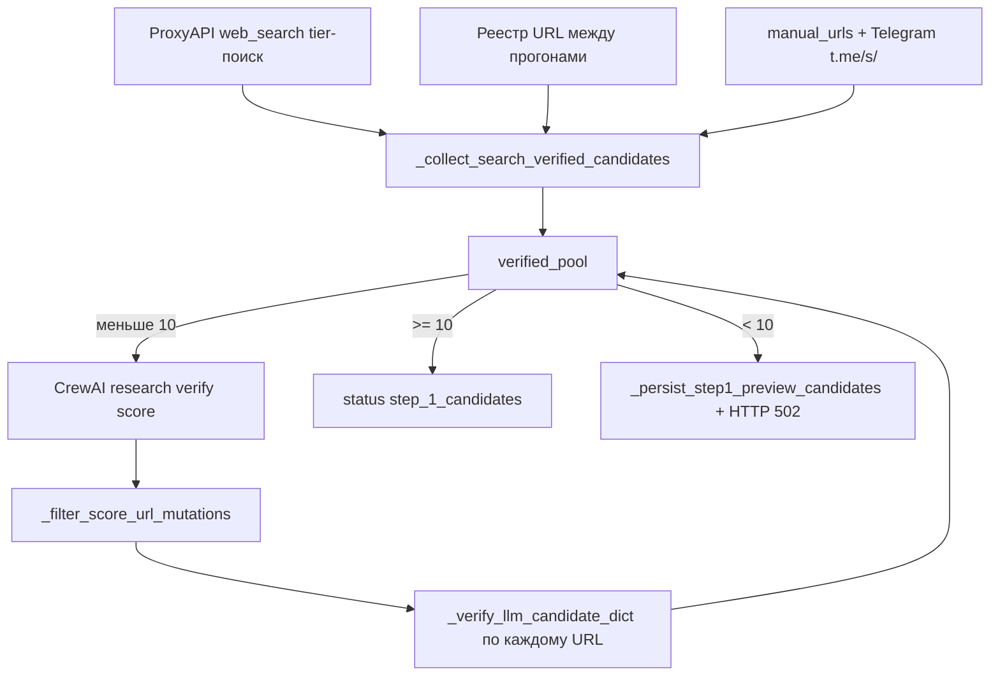

# Runbook: нерабочие ссылки и серые карточки на шаге 1

> **Для агентов Cursor:** при жалобах «ссылки не работают», «мало зелёных плашек», «502 на шаге 1» — **сначала читайте этот файл целиком**, затем смотрите логи и тесты ниже. Не ослабляйте проверки вслепую и не возвращайте доверие к URL от LLM.

## Симптомы

| Что видит пользователь | Что это значит |
| ------------------------ | ---------------- |
| Много карточек, **1–2 зелёные** плашки «Можно в топ‑5» | Большинство кандидатов не прошли **серверную** HTTP-проверку |
| Заголовок есть, но «Ссылка не подтверждена» | Страница частично открылась или title остался от **LLM**, а не с HTML |
| Ошибка **502** после «Пересобрать пул» | В `verified_pool` < **10**; в БД могли сохраниться **preview**-кандидаты без зелёных статусов |
| Ссылка в браузере открывается, в UI — серая | Регрессия логики `_verify_llm_candidate_dict` / редиректов / `no_article_markers` |

## Что считается «рабочей ссылкой» (истина в UI)

Зелёные чипы на шаге 2 (`DigestWizard.tsx`):

- **Ссылка рабочая** → `NewsCandidate.link_status === true`
- **Читаемый заголовок** + **Можно в топ‑5** → `headline_editorial_ok === true` и прочие фильтры (не агрегатор, не дубликат, tier)

**Источник истины — не CrewAI**, а сервер:

1. `GET` страницы → `_fetch_article_page_bundle()` в `digest_service.py`
2. Нормализация URL и заголовка → `_verify_llm_candidate_dict()`
3. Только после успеха — запись в `verified_pool` и БД

Поля `title` / `url` от `NewsResearchAgent` / `ScoringAgent` **нельзя** считать проверенными, пока не отработал `_verify_llm_candidate_dict`.

## Поток данных (шаг 1)



**Порядок приоритета URL:** tier web_search (citations ProxyAPI) → ручные URL / Telegram → реестр (только при достаточном пуле) → CrewAI при verified < 10.

## Ключевые файлы

| Файл | Ответственность |
| ------ | ----------------- |
| `backend/app/services/digest_service.py` | HTTP fetch, verify, шаг 1, reject-коды |
| `backend/app/services/news_search.py` | Tier-поиск, prefilter, strict citations |
| `backend/app/proxyapi_client.py` | `search_news_article_urls()` |
| `backend/app/services/step1_url_registry.py` | Реестр raw/verified/reject, TTL |
| `backend/app/services/step1_web_search_cache.py` | Кэш ответов web_search |
| `backend/app/crew/workflow.py` | Промпты research/verify/score (не подменяют HTTP) |
| `backend/app/prompts/digest_contract.txt` | Контракт: не менять `url` между агентами |
| `frontend/components/DigestWizard.tsx` | Чипы `link_status` / `headline_editorial_ok` |
| `backend/tests/test_step1_link_validation_smoke.py` | Smoke verify/bundle/redirect |
| `backend/tests/test_step1_regression_pipeline.py` | Регрессии шага 1, rebuild, score URL |

## Коды отбраковки (`REJECT_REASON:*`)

Смотреть в UI: «Подробнее» у карточки, журнал проверки ссылок или `GET /digests/{id}/step1/statistics`.

| Код | Типичная причина | Что проверять |
| ----- | ------------------ | ------------------------- |
| `http_unreachable` | Сайт не отдал HTML (403, 404, таймаут) | `_http_get_html_for_article`, User-Agent, сеть |
| `url_redirect_mismatch` | Редирект на **главную** или другой домен **без** статьи | `_redirect_should_reject`: при заголовке ≥8 с редиректа **не** отклонять |
| `llm_hallucinated_url` | URL не открывается или подозрительный slug | strict citations для serious; не ослаблять score guard |
| `url_mutated_between_agents` | ScoringAgent сменил `url` | `_filter_score_url_mutations` — url из verify, баллы из score |
| `no_article_markers` | Нет og:article / мало текста | `_page_is_article_like`: заголовок + corpus ≥120 символов достаточно |
| `non_article_page` | Нет h1/og:title ≥8 символов | `_choose_coherent_headline`, разметка сайта |
| `off_topic_not_ai` | Тема не ИИ | `_ai_digest_topic_matches` |
| `off_topic_not_curious` | Не курьёзный тон | `curious_tone.py` |
| `aggregator_source` | Google News, Reddit, лента | `news_search._is_bad_search_url` |
| `news_listing_page` | Рубрика, лента, индексный пул | `is_listing_page_url`, `is_topic_pool_page_url`; `_expand_listing_url_candidates` разворачивает ленту |
| `support_documentation_page` | Страница поддержки / документации | prefilter + verify |
| `placeholder_candidate` | Заглушка `example.com/ai-news` | `web.enable_fetch`, ProxyAPI key |
| `published_before_window` | Дата материала раньше окна шага 0 | `news_window_days`, `digest_earliest_news_date()` |
| `recent_top5_repeat` | Тот же URL уже был в топ-5 зафиксированного выпуска | `step1_recent_top5.py` |

## Инварианты (не ломать при правках)

1. **Редирект с URL поиска на канонический URL статьи — норма.**  
   `_redirect_should_reject()` → `False`, если в bundle есть `headline` (≥8 символов) или маркеры статьи.

2. **Страница с заголовком и текстом — статья**, даже без `article:published_time`.  
   `_page_is_article_like()` — не требовать только `article_markers`.

3. **`link_status = true` только после успешного verify.**  
   При любом отказе выставлять `link_status = false`.

4. **ScoringAgent не меняет `url`.**  
   `_filter_score_url_mutations`: merge по `original_number`, URL из verify.

5. **Strict citations для serious tier_strict:** при пустых citations vetted fallback из текста модели **не используется**.

6. **В карточке хранить `final_url` после редиректа**, не «сырой» URL из выдачи.

7. **Перед `_verify_llm_candidate_dict` для LLM-кандидатов сбрасывать `title`**, чтобы в preview не светился заголовок модели при failed verify.

8. **При нехватке пула (verified < 10) приоритет — свежий web_search**, не stale-ссылки из реестра URL.

## Диагностика (порядок для агента)

### 1. Логи backend

Файл: `backend/logs/app-YYYY-MM-DD.log`

```text
Шаг 1: полная пересборка пула
Шаг 1: сохранено проверенных кандидатов
HTTP 502 ... Основные причины отбраковки: code=N
Tier-поиск: Tier-1 | hosts=...
Web search: vetted model URL fallback
```

Строка `Основные причины отбраковки` — главный указатель. Смотрите также `urls_sent_to_http`, `verified_total`, `stop_reason` в `step1_collection_meta`.

### 2. Тесты (обязательно после правок verify/redirect)

```bash
cd backend
python -m pytest tests/test_step1_link_validation_smoke.py tests/test_step1_regression_pipeline.py tests/test_step1_web_search_citations.py -q
```

Критичные кейсы:

- `test_redirect_allowed_when_headline_extracted_without_article_markers`
- `test_verify_accepts_redirected_article_with_headline`
- `test_verify_rejects_redirect_to_homepage`
- `test_step1_keeps_verify_url_when_score_mutates_url`

### 3. Ручная проверка одного URL

```python
from app.services.digest_service import _fetch_article_page_bundle, _redirect_should_reject, _page_is_article_like

url = "https://..."
b = _fetch_article_page_bundle(url)
print(b.get("ok"), b.get("headline"), b.get("final_url"))
print("redirect_reject", _redirect_should_reject(url, b["final_url"], b))
print("article_like", _page_is_article_like(b))
```

### 4. Конфиг

Минимум для автопоиска:

```env
PROXYAPI_API_KEY=...
```

Поведение задаётся `pipeline_settings.json` → `web.enable_fetch: true`.  
Опционально: `SERPAPI_API_KEY`, `TAVILY_API_KEY` + `web_search_prefer_alt_providers: true`.

Успешный шаг 1 требует **минимум 10** проверенных материалов в `verified_pool`.

## Типовые проблемы

| Симптом | Вероятная причина | Где смотреть |
| ----------- | --------- | ------------ |
| Массовый `url_redirect_mismatch` при живых статьях | Жёсткая проверка fingerprint | `_redirect_should_reject` |
| Заголовок есть, всё серое | Требование только `article_markers` | `_page_is_article_like` |
| `url_mutated_between_agents` | Доверие к URL из ScoringAgent | `_filter_score_url_mutations` |
| Много `http_unreachable` на доменах из поиска | Выдуманные URL при пустых citations | strict citations, `news_search.py` |
| `published_before_window` доминирует | Stale URL из реестра или выдачи | реестр отключается при short pool; окно дат шага 0 |
| `urls_sent_to_http` << 10 | Мало raw после tier-поиска | логи tier-батчей, `empty_citation_streak` |
| Preview при 502 как «итог» | Пересборка не добрала до 10 | rebuild восстанавливает прежний пул, если был ≥10 |

## Действия пользователя

1. **Перезапустить backend** после деплоя правок.
2. Шаг 1 → **«Пересобрать пул кандидатов»** (`POST .../step1/run` с `"rebuild": true`).
3. Выбирать только строки с **тремя зелёными** чипами.
4. При стабильных сбоях одного домена — добавить **прямые URL** в textarea шага 1.

## API

```http
POST /digests/{id}/step1/run
Content-Type: application/json

{
  "manual_urls": ["https://..."],
  "rebuild": true
}
```

`rebuild: true` обязателен, если выпуск уже прошёл шаги 2–4.

## Связанные документы

- [README.md](../README.md) — обзор пайплайна и `.env`
- [AGENTS.md](../AGENTS.md) — указатель для агентов Cursor
- [STEP1_PIPELINE.md](STEP1_PIPELINE.md) — дорожка шага 1
- [STEP1_SEARCH_FLOWCHART.md](STEP1_SEARCH_FLOWCHART.md) — блок-схема
- `backend/app/prompts/digest_contract.txt` — правило неизменности `url` / `published_at`

---

*При изменении `_verify_llm_candidate_dict`, `_redirect_should_reject`, `_filter_score_url_mutations`, strict citations или порядка web_search vs CrewAI — обновите этот runbook и прогоните тесты из раздела «Диагностика».*
