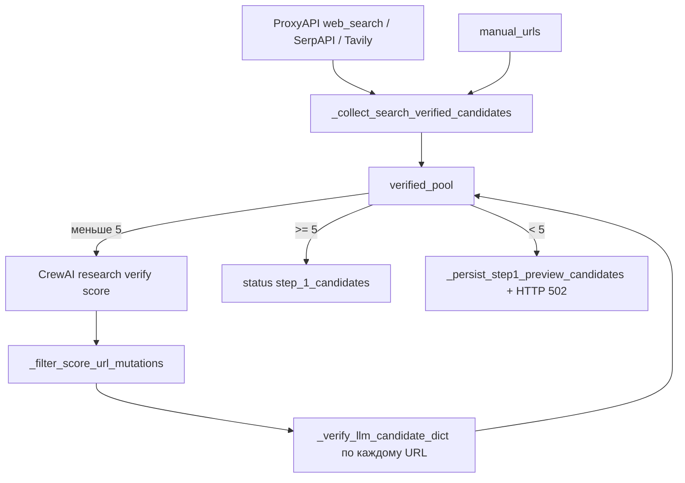

# Runbook: нерабочие ссылки и серые карточки на шаге 1

> **Для агентов Cursor:** при жалобах «ссылки не работают», «мало зелёных плашек», «502 на шаге 1» — **сначала читайте этот файл целиком**, затем смотрите логи и тесты ниже. Не ослабляйте проверки вслепую и не возвращайте доверие к URL от LLM.

## Симптомы

| Что видит пользователь | Что это значит |
| ------------------------ | ---------------- |
| Много карточек, **1–2 зелёные** плашки «Можно в топ‑5» | Большинство кандидатов не прошли **серверную** HTTP-проверку |
| Заголовок есть, но «Ссылка не подтверждена» | Страница частично открылась или title остался от **LLM**, а не с HTML |
| Ошибка **502** после «Пересобрать пул» | В `verified_pool` < 5; в БД могли сохраниться **preview**-кандидаты (до 24 шт.) без зелёных статусов |
| Ссылка в браузере открывается, в UI — серая | Регрессия логики `_verify_llm_candidate_dict` / редиректов / `no_article_markers` |

## Что считается «рабочей ссылкой» (истина в UI)

Зелёные чипы на шаге 2 (`DigestWizard.tsx`):

- **Ссылка рабочая** → `NewsCandidate.link_status === true`
- **Читаемый заголовок** + **Можно в топ‑5** → `headline_editorial_ok === true` и прочие фильтры (не агрегатор, не дубликат, tier)

**Источник истины — не CrewAI**, а сервер:

1. `GET` страницы → `_fetch_article_page_bundle()` в `digest_service.py`
2. Нормализация URL и заголовка → `_verify_llm_candidate_dict()`
3. Только после успеха — запись в `verified_pool` и БД

Поля `title` / `url` от `NewsResearchAgent` / `ScoringAgent` **нельзя** считать проверенными, пока не отработал `_verify_llm_candidate_dict`.

## Поток данных (шаг 1)



**Порядок приоритета URL:** веб-поиск (реальные URL) → ручные URL → CrewAI только если после поиска < 5 подтверждённых.

## Ключевые файлы

| Файл | Ответственность |
| ------ | ----------------- |
| `backend/app/services/digest_service.py` | HTTP fetch, verify, шаг 1, reject-коды |
| `backend/app/services/news_search.py` | Цепочка ProxyAPI → SerpAPI → Tavily |
| `backend/app/proxyapi_client.py` | `search_news_article_urls()` |
| `backend/app/crew/workflow.py` | Промпты research/verify/score (не подменяют HTTP) |
| `backend/app/prompts/digest_contract.txt` | Контракт: не менять `url` между агентами |
| `frontend/components/DigestWizard.tsx` | Чипы `link_status` / `headline_editorial_ok` |
| `backend/tests/test_step1_link_validation_smoke.py` | Smoke verify/bundle/redirect |
| `backend/tests/test_step1_regression_pipeline.py` | Регрессии шага 1, rebuild, score URL |

## Коды отбраковки (`REJECT_REASON:*`)

Смотреть в UI: «Подробнее» у карточки или `Asset.type = step1_rejected_reasons` в ответе `GET /digests/{id}`.

| Код | Типичная причина | Что проверять / чинить |
| ----- | ------------------ | ------------------------- |
| `http_unreachable` | Сайт не отдал HTML (403, 404, таймаут) | `_http_get_html_for_article`, User-Agent, сеть; не путать с «галлюцинацией» |
| `url_redirect_mismatch` | Редирект на **главную** или другой домен **без** статьи | `_redirect_should_reject`: при заголовке ≥8 с редиректа **не** отклонять |
| `llm_hallucinated_url` | Устар.: сейчас чаще `http_unreachable` в prefilter | URL от research не открывается — **не** ослаблять score guard |
| `url_mutated_between_agents` | ScoringAgent сменил `url` | `_filter_score_url_mutations` должен **брать url из verify**, баллы из score |
| `no_article_markers` | Нет og:article / мало текста | `_page_is_article_like`: заголовок + corpus ≥120 символов достаточно |
| `non_article_page` | Нет h1/og:title ≥8 символов | `_choose_coherent_headline`, разметка сайта |
| `off_topic_not_ai` | Тема не ИИ | `_ai_digest_topic_matches` — заголовок с маркером ИИ уже проходит |
| `aggregator_source` | Google News, Reddit, лента | `news_search._is_bad_search_url`, `_classify_source_policy` |
| `news_listing_page` | Рубрика, лента, **индексный пул** (напр. CNews `/book/mutual/{id}/{id}`), `/news`, `arxiv.org/list/…` | `is_listing_page_url` + `is_topic_pool_page_url`; `_expand_listing_url_candidates` разворачивает ленту в дочерние статьи, **не** сохраняет индекс как кандидата |
| `placeholder_candidate` | Заглушка `example.com/ai-news` | `ENABLE_WEB_FETCH`, ProxyAPI key |
| `published_before_window` | Дата материала раньше окна шага 0 | `news_window_days` / `news_window_day_kind`, `digest_earliest_news_date()` |

## Как починили ссылки (2026-05)

После серии регрессий зафиксирован **порядок и инварианты**, при которых зелёные чипы снова соответствуют реальным статьям:

1. **Источник URL:** ProxyAPI web_search (итеративные батчи + короткие supplement-раунды) → ручные URL → CrewAI **только** если после поиска < `STEP1_MIN_VERIFIED` (10).
2. **Prefilter до HTTP:** `url_suspected_hallucinated` (обрезанный slug, `/doc/5678901`, дата `15052026` в path), `is_topic_pool_page_url` (индексные пулы CNews `/book/mutual/`).
3. **Verify:** `link_status = false` в начале; зелёный статус только после успешного GET, заголовка с HTML и темы ИИ; URL в карточке — `final_url` после редиректа.
4. **Score не меняет URL:** `_filter_score_url_mutations` — баллы из score, `url` из verify.
5. **Rebuild:** backup/restore пула, если было ≥10 зелёных; не затирать проверенный пул preview при 502.
6. **Окно дат (шаг 0):** материалы старше `digest.date − news_window_days` (календарные или рабочие пн–пт) отсекаются с `published_before_window` — устраняет попадание статей вроде Ведомостей 2023 при выпуске 2026-05.

## Инварианты (не ломать при правках)

Это зафиксировано после debug-сессии и регрессий; нарушение снова даёт «заголовок есть, ссылка серая»:

1. **Редирект с URL поиска на канонический URL статьи — норма.**  
   `_redirect_should_reject()` → `False`, если в bundle есть `headline` (≥8 символов) или маркеры статьи.

2. **Страница с заголовком и текстом — статья**, даже без `article:published_time`.  
   `_page_is_article_like()` — не требовать только `article_markers`.

3. **`link_status = true` только после успешного verify.**  
   При любом `return` с отказом выставлять `link_status = false` (не оставлять `true` от skeleton).

4. **ScoringAgent не меняет `url`.**  
   `_filter_score_url_mutations`: merge по `original_number`, URL из verify.

5. **CrewAI research не запускать**, если веб-поиск уже дал ≥10 подтверждённых (`STEP1_MIN_VERIFIED`).  
   Иначе снова доминируют `llm_hallucinated_url` / `url_mutated_between_agents`.

6. **В карточке хранить `final_url` после редиректа**, не «сырой» URL из выдачи (см. комментарий у manual/search verify).

7. **Перед `_verify_llm_candidate_dict` для LLM-кандидатов сбрасывать `title`**, чтобы в preview не светился заголовок модели при failed verify.

## Диагностика (порядок для агента)

### 1. Логи backend

Файл: `backend/logs/app-YYYY-MM-DD.log`

```text
Шаг 1: полная пересборка пула
Шаг 1: сохранено проверенных кандидатов
HTTP 502 ... Основные причины отбраковки: code=N
```

Строка `Основные причины отбраковки` — главный указатель, **что** сломалось.

### 2. Тесты (обязательно после правок verify/redirect)

```bash
cd backend
python -m pytest tests/test_step1_link_validation_smoke.py tests/test_step1_regression_pipeline.py -q
```

Критичные кейсы:

- `test_redirect_allowed_when_headline_extracted_without_article_markers`
- `test_verify_accepts_redirected_article_with_headline`
- `test_verify_rejects_redirect_to_homepage`
- `test_step1_keeps_verify_url_when_score_mutates_url`

### 3. Ручная проверка одного URL

В Python REPL / тесте:

```python
from app.services.digest_service import _fetch_article_page_bundle, _redirect_should_reject, _page_is_article_like

url = "https://..."
b = _fetch_article_page_bundle(url)
print(b.get("ok"), b.get("headline"), b.get("final_url"))
print("redirect_reject", _redirect_should_reject(url, b["final_url"], b))
print("article_like", _page_is_article_like(b))
```

### 4. Конфиг `.env`

Минимум для автопоиска:

```env
ENABLE_WEB_FETCH=true
PROXYAPI_API_KEY=...
PROXYAPI_WEB_SEARCH_ENABLED=true
```

Шаг 1 формирует пул сразу после набора 10 валидных страниц (без дополнительного порога воронки).

Опционально: `SERPAPI_API_KEY`, `TAVILY_API_KEY`. Без ключа и без ручных URL шаг 1 не соберёт пул.

## Типовые регрессии («что ломается»)

| Регрессия | Симптом | Где чинить |
| ----------- | --------- | ------------ |
| Снова жёсткий `orig_fp != stor_fp` → reject | Массовый `url_redirect_mismatch` при живых статьях | `_redirect_should_reject` |
| Требовать только `article_markers` | Заголовок с страницы есть, всё серое | `_page_is_article_like` в verify |
| Доверять `url` из ScoringAgent | `url_mutated_between_agents` в логе | `_filter_score_url_mutations` |
| Всегда вызывать Crew research | Много битых URL при успешном web_search | условие `len(verified_pool) < STEP1_MIN_VERIFIED` |
| Preview при 502 как «итог» | 18 карточек, 1 зелёная | при неудачной **пересборке** восстанавливается прежний пул (если был ≥5 зелёных); иначе rebuild |
| CrewAI до добора web_search | Много `http_unreachable` на выдуманных URL | сначала итеративные батчи web_search, потом CrewAI |
| URL вида `.../15052026/` или обрезанный slug | 404, `llm_hallucinated_url` | `url_suspected_hallucinated` в поиске и prefilter |
| Показывать LLM title при failed verify | Заголовок правдоподобный, ссылка серая | сброс `title` перед verify в llm_merged |

## Действия пользователя

1. **Перезапустить backend** после деплоя правок.
2. Шаг 1 → **«Пересобрать пул кандидатов»** (`POST .../step1/run` с `"rebuild": true`).
3. Выбирать только строки с **тремя зелёными** чипами.
4. При стабильных сбоях одного домена — добавить **прямые URL** в textarea шага 1.

## API

```http
POST /digests/{id}/step1/run
Content-Type: application/json

{
  "manual_urls": ["https://..."],
  "rebuild": true
}
```

`rebuild: true` обязателен, если выпуск уже прошёл шаги 2–4.

## Связанные документы

- `README.md` — обзор пайплайна и `.env`
- `AGENTS.md` — указатель для агентов Cursor
- `backend/app/prompts/digest_contract.txt` — правило неизменности `url` / `published_at`

## История проблем (кратко)

- **Debug:** подтверждено — research **галлюцинирует** URL; verify/score URL не меняют; редиректы на статью принимать; HTTP — источник истины.
- **2026-05:** массовые серые плашки из‑за строгих редиректов + `url_mutated_between_agents` + preview при 502 — исправлено инвариантами выше; добавлено окно дат на шаге 0 (`published_before_window`).

---

*При изменении `_verify_llm_candidate_dict`, `_redirect_should_reject`, `_filter_score_url_mutations` или порядка web_search vs CrewAI — обновите этот runbook и прогоните тесты из раздела «Диагностика».*
