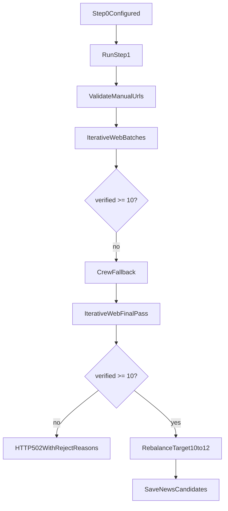

# Дорожка шага 1: итеративный сбор пула

Шаг 1 работает батчами: tier-поиск URL, prefilter, HTTP-верификация страниц, накопление валидных кандидатов и stop по времени/бюджету.

См. также: [STEP1_LINKS_RUNBOOK.md](STEP1_LINKS_RUNBOOK.md), [STEP1_SEARCH_FLOWCHART.md](STEP1_SEARCH_FLOWCHART.md).

## Ключевая модель

| Параметр | Значение | Источник |
|----------|----------|----------|
| Минимум успешного пула | **10** проверенных материалов | `STEP1_MIN_VERIFIED` в `digest_service.py` |
| Целевой размер пула для UI | до **20** | `max_candidates_for_ui` в `pipeline_settings.json` |
| Минимум первого предложения | **15** | `first_offer_min_candidates` в `pipeline_settings.json` |
| Порог воронки | **10** | `min_discovered_pages` в `step1_filter_settings.json` |
| Батч tier-поиска | **14** URL | `batch_size` |
| Сырые URL за collect | до **64** | `search_fetch_limit` |
| HTTP-проверок за collect | до **48** | `urls_checked_per_collect` |
| Soft / hard timebox | **480 / 600** с | `soft_time_limit_sec`, `hard_time_limit_sec` |
| Мин. итераций (serious) | **5** | `min_collection_iterations` в `step1_filter_settings.json` |
| Мин. итераций (curious) | **2** | там же, секция `curious` |
| ProxyAPI-батчей за tier-проход | до **12** | `tier_max_web_search_batches` |
| Extra батчи курьёзного добора | **0–10** | `serious_curious_extra_batches` |
| Бюджет ProxyAPI | **50 ₽** | `max_cost_rub` |
| HTTP workers | **8** | `verify_workers` |

## Настройки

| Параметр | Где задаётся |
|----------|--------------|
| Тип и окно выпуска | `POST /digests/{id}/step0`; смена только окна — `PATCH /digests/{id}/news-window` или поля в теле `POST …/step1/run` |
| Баланс serious/curious в unified режиме | Ползунок шага 0 (1–10) → `step1_serious_curious_extra_batches` |
| Дефолты шага 0 | `backend/app/digest_defaults.json` (`step0`) |
| Фильтры шага 1 и порог воронки | `backend/app/step1_filter_settings.json` (профили **serious** и **curious**); UI «Настройки фильтра новостей» → `GET/PUT /digests/{id}/step1/filters` |
| Технические лимиты шага 1 | `backend/app/pipeline_settings.json`; переопределение через `.env` (`STEP1_*`) |
| Ключи ProxyAPI / SerpAPI / Tavily | `backend/.env` |
| Автосбор | `web.enable_fetch` в `pipeline_settings.json` |

## Веб-поиск и политика источников

При `step1.tier_strict_search: true` (по умолчанию) шаг 1 **не** делает «общий» поиск по интернету:

1. Берутся хосты tier-1 → tier-4 из `backend/app/prompts/source_tiers.txt`.
2. Для каждого батча (до 3 доменов) формируется запрос с `site:` и подсказками из `search_seed_urls`.
3. ProxyAPI (и опционально SerpAPI/Tavily) получают `allowed_hosts` — URL вне политики отбрасываются на prefilter (`non_policy_source`).

Режим `tier_strict_search: false` — один общий запрос + добор tier-1 при нехватке сырых URL (< `search_tier1_min_raw_urls`, по умолчанию 15).

### Strict citations (serious + tier_strict)

Для серьёзного выпуска в режиме tier_strict включён **strict citations**: URL берутся только из citations ответа ProxyAPI web_search. Если citations пустые, **vetted fallback** из текста модели не используется — это снижает долю выдуманных URL.

### Short-pool режим

Когда verified < 10 или есть `pool_shortfall`:

- реестр URL **не используется** как основной seed (лимит raw из реестра — `step1_registry_max_raw_when_short_pool: 8`);
- tier-поиск переключается на **medium** context, увеличивает лимит фазы (90–150 с), принудительно идёт через ProxyAPI (`force_proxyapi`);
- supplement-раундов меньше (при tier_strict и verified < 3 — максимум **1** раунд).

### Реестр URL (`step1_url_registry.py`)

Между прогонами сохраняются сырые, проверенные и отбракованные URL (TTL 90 дней, таблица `step1_url_registry`). При успешном сборе реестр пополняется; при нехватке пула приоритет — свежий web_search, не stale-ссылки из реестра. URL вне окна дат выпуска вычищаются (`purge_registry_urls_outside_window`).

### Кэш web_search

Ответы ProxyAPI web_search кэшируются локально (`step1_web_search_cache.py`, TTL 90 дней) при `web_search_cache_enabled: true`.

## Единый режим «Дайджест ИИ»

С **2026-08** в интерфейсе один режим выпуска — **«Дайджест ИИ»** (`digest_type=serious` в API/БД). Legacy-значение `curious` в старых запросах и записях нормализуется в `serious`.

| | **Дайджест ИИ** (unified) | **Legacy curious** (только старые выпуски в БД) |
|---|---------------------------|--------------------------------------------------|
| Домены поиска | `source_tiers.txt` (tier-1…4) + добор `curious_source_hosts` | ранее — только `curious_source_hosts.txt` |
| Prefilter | tier-1…4 + `allow_curious_tiers_in_serious` | curious-список |
| Фильтры | секция `serious` в `step1_filter_settings.json` | секция `curious` (+ `off_topic_not_curious`) — не используется для новых выпусков |
| Фильтр тона | нет `off_topic_not_curious` | `off_topic_not_curious` (`curious_tone.py`) |
| Пресс-релизы в rebalance | 20–35% | 0% (legacy) |
| Маршрутизация | `resolve_step1_search_routing` → `serious_tier` | — |
| Добор разнообразия | `fetch_curious_prioritized_raw_urls` + practical/curious rescue | — |

При нехватке кандидатов unified-режим запускает **controlled rescue**: practical tools → curious human/viral/angles → fresh tier-1.

### Legacy: курьёзный выпуск (до объединения)

Старые выпуски с `digest_type=curious` в БД сохраняют курьёзный заголовок/лид на шаге 4. Новый сбор шага 1 для любого выпуска идёт по unified-контуру.

## Окно дат публикации

- Нижняя граница: `digest_earliest_news_date` от **верхней** границы окна (`max(дата выпуска, сегодня по МСК)`).
- `published_before_window` — известная дата **раньше** окна (pre_http по дате в URL, verify по странице).
- `published_date_undefined` — дату извлечь не удалось (только verify, **по умолчанию выключен**).

## Что считается валидной статьёй

Материал попадает в `verified_pool`, только если:

- `headline_editorial_ok == true`;
- `link_status == true`;
- `is_aggregator == false`;
- URL уникален по fingerprint.

Проверка: `_verify_llm_candidate_dict` (HTTP, anti-noise URL, тематика ИИ, окно даты, source-tier policy).

## Последовательность шага 1

### 0) Telegram-монитор (t.me/s/, без Bot API)

- Каналы из `telegram_monitor_channels` (по умолчанию `technokratos,AI_UD`).
- Парсинг постов → **только внешние** `http(s)` (не `t.me`, не сайт компании).
- Ссылки проходят ту же верификацию, что и manual URL.
- Посты старше окна дат пропускаются; Telegram идёт через прямой HTTP (`telegram_via_proxyapi: false`).

### 1) Ручные URL

- `_build_manual_candidates` валидирует каждый URL сразу.
- Битая ручная ссылка → `400`.
- Успешные ручные ссылки сразу попадают в `verified_pool`.

### 2) Итеративные web-батчи

Метод `_step1_collect_iterative_batches`:

- на каждой итерации — tier-поиск, prefilter, HTTP-верификация;
- при нехватке — supplement/top-up (ограниченное число раундов);
- seed listing fallback — HTTP-разбор лент из `search_seed_urls`;
- логи: номер итерации, добавлено, общее число, elapsed, stop_reason.

Stop-правила:

- hard timeout (600 с) → stop;
- soft timeout (480 с) → финальная попытка добрать до `collection_target_pages`;
- `min_collection_iterations` — soft-таймаут и `no_progress` не останавливают сбор, пока не выполнено минимум итераций;
- две итерации подряд без новых verified (`no_progress`) → stop (после минимума итераций);
- лимит бюджета `max_cost_rub` (50 ₽) → stop;
- отмена пользователем → `POST …/step1/cancel`.

### 3) Crew fallback

Если после web-итераций verified < 10 и `crew_fallback_only_if_empty: false`:

- `NewsResearchAgent` → `SourceVerificationAgent` → `ScoringAgent`;
- защита URL (`_filter_score_url_mutations`);
- повторная page-верификация каждого URL.

### 4) Финал

- Если после всех проходов verified < 10 → `502` + breakdown причин; частичный preview может сохраниться в БД.
- Если verified ≥ 10 → rebalance с целевым размером до 12, но не ниже 10.
- В БД: `NewsCandidate`, `step1_collection_meta` (elapsed, funnel, stop_reason, `serious_curious_extra_batches`, `first_offer_min_candidates`), обновление реестра URL.

## Что видно в UI

- Блок «Итоги сбора пула» (итерации, stop_reason, elapsed, verified).
- «Статистика отбраковки ссылок» — суммы по кодам фильтров + `journal_totals`.
- Модалка «Настройки фильтра новостей» — журнал последнего прогона, `filters_applied_last_run`.
- **Журнал проверки ссылок** — каждый URL, заголовок, статус «в пуле / не в пуле», причина.
- Кнопка «Все найденные новости» — полный список для ручных оценок.
- `GET /digests/{id}/step1/statistics` — детальная воронка, стоимость, insights.

## Таймаут браузера

`POST /digests/{id}/step1/run` не обрывается фронтом по 15 минутам. Для шагов 3–4 остаётся защитный таймаут 60 минут.
