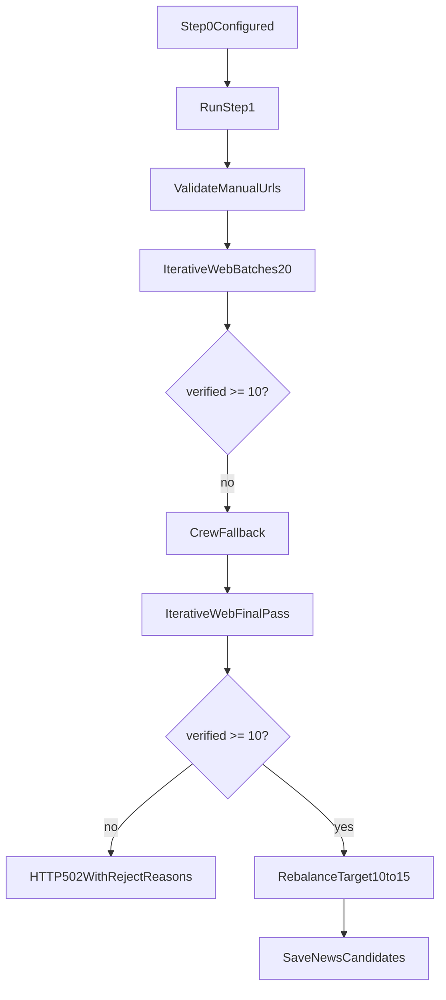

# Дорожка шага 1: итеративный сбор пула

Шаг 1 работает батчами: поиск URL, верификация страниц, накопление валидных кандидатов и ранний stop по времени.

См. также: [STEP1_LINKS_RUNBOOK.md](STEP1_LINKS_RUNBOOK.md).

## Ключевая модель

- Батч поиска: `20` URL (`STEP1_BATCH_SIZE`); за проход запрашивается до `STEP1_SEARCH_FETCH_LIMIT` (100) сырых URL у **всех** провайдеров (ProxyAPI + SerpAPI + Tavily), на HTTP уходит до `STEP1_URLS_CHECKED_PER_COLLECT` (80).
- Timebox: `soft=180s`, `hard=300s`.
- Минимум воронки: `min_discovered_pages` (единственный источник — `backend/app/step1_filter_settings.json`, правка через «Настройки фильтра новостей»).
- Минимум для успеха финального пула: `10` проверенных материалов.
- Целевой размер пула для UI: `10–15` (`STEP1_MAX_CANDIDATES_FOR_UI`, по умолчанию `15`).

## Настройки

| Параметр | Где задаётся |
|----------|--------------|
| Тип и окно выпуска | `POST /digests/{id}/step0`; смена только окна — `PATCH /digests/{id}/news-window` или поля в теле `POST …/step1/run` (UI передаёт их при каждом запуске/пересборке) |
| Дефолты шага 0 | `backend/app/digest_defaults.json` (`step0`) |
| Фильтры шага 1 и порог воронки | `backend/app/step1_filter_settings.json` (профили **serious** и **curious** не смешиваются); UI «Настройки фильтра новостей» → `GET/PUT /digests/{id}/step1/filters` (по `digest_type` выпуска) |
| Технические лимиты шага 1 | `backend/app/pipeline_settings.json` (`batch_size`, `soft/hard_time_limit_sec`, `max_candidates_for_ui`, `verify_workers`, …); переопределение через `.env` (`STEP1_*`) |
| Ключи и ProxyAPI web_search | `backend/.env` (`PROXYAPI_WEB_SEARCH_*`, `SERPAPI_API_KEY`, `TAVILY_API_KEY`; `STEP1_MAX_COST_RUB` при необходимости) |
| Автосбор (`web.enable_fetch`) | `backend/app/pipeline_settings.json` |

### Веб-поиск и политика источников

По умолчанию (`step1.tier_strict_search: true` в `pipeline_settings.json`) шаг 1 **не** делает «общий» поиск по интернету. Вместо этого:

1. Берутся хосты tier-1 → tier-4 из `backend/app/prompts/source_tiers.txt`.
2. Для каждого батча (до 3 доменов) формируется запрос с `site:` и подсказками из `search_seed_urls`.
3. ProxyAPI / SerpAPI / Tavily получают `allowed_hosts` / `include_domains` — URL вне политики отбрасываются на prefilter (`non_policy_source`).

Режим `tier_strict_search: false` возвращает прежнее поведение: один общий запрос + добор tier-1 при нехватке сырых URL (&lt; `STEP1_SEARCH_TIER1_MIN_RAW_URLS`).

### Разделение серьёзный / курьёзный

| | **Серьёзный** (`digest_type=serious`) | **Курьёзный** (`digest_type=curious`) |
|---|--------------------------------------|----------------------------------------|
| Домены поиска | `source_tiers.txt` (tier-1…4) | `curious_source_hosts.txt` |
| Prefilter `non_policy_source` | tier-1…4 | curious-список |
| Фильтры (настройки) | секция `serious` в `step1_filter_settings.json` | секция `curious` (+ `off_topic_not_curious`) |
| Фильтр тона | нет | `off_topic_not_curious` |
| Пресс-релизы в rebalance | 20–35% | 0% |
| Маршрутизация в коде | `resolve_step1_search_routing` → `serious_tier` | → `curious_hosts` |

Контуры **не пересекаются**: при `serious` функция `fetch_curious_prioritized_raw_urls` не вызывается.

### Курьёзный выпуск (`digest_type=curious`)

На шаге 1 **не используется** `source_tiers.txt`. Поиск идёт по доменам из `backend/app/prompts/curious_source_hosts.txt` (MAXIM, vc.ru, habr, dzen, reddit, 9gag и др.; **без** RIA/Интерфакс/Ведомостей): сначала развлекательные RU, затем tech/lifestyle RU, затем зарубежные; за итерацию — два угла запроса (RU-курьёз + viral/foreign). После HTTP-проверки действует фильтр **`off_topic_not_curious`** (см. `curious_tone.py`): отсекается сухой официоз; допускаются «человеческие» сюжеты про ИИ без слова «смешной». Фильтр **`published_date_undefined`** для курьёза **выключен** (только серьёзный профиль). Пресс-релизы не добираются; в rebalance квота пресс = 0, доля RU 55–85%. Заголовки — на русском.

Дополнительно:

- `PROXYAPI_WEB_SEARCH_CONTEXT_SIZE` (обычно `medium`) — для tier-батчей используется `PROXYAPI_WEB_SEARCH_CONTEXT_SIZE_SUPPLEMENT` (`low`).
- Fallback на `*-search-preview` — **только при ошибке** Responses API, не при пустом парсинге URL (иначе двойная оплата поиска).
- Документация: [proxyapi.ru/docs/openai-web-search](https://proxyapi.ru/docs/openai-web-search).

## Окно дат публикации

- Нижняя граница: `digest_earliest_news_date` от **верхней** границы окна (`max(дата выпуска, сегодня по МСК)`), чтобы старый выпуск в БД не отсекал свежие новости.
- Отбраковка по дате в конфиге разделена:
  - `published_before_window` — известная дата **раньше** окна (pre_http по дате в URL, verify по странице);
  - `published_date_undefined` — дату извлечь не удалось (только verify, **по умолчанию выключен**).

## Что считается валидной статьёй

Материал попадает в `verified_pool`, только если:

- `headline_editorial_ok == true`;
- `link_status == true`;
- `is_aggregator == false`;
- URL уникален по fingerprint.

Проверка: `_verify_llm_candidate_dict` (HTTP, anti-noise URL, тематика ИИ, окно даты, source-tier policy).

## Последовательность шага 1

### 0) Telegram-монитор (t.me/s/, без Bot API)

- Каналы из `STEP1_TELEGRAM_MONITOR_CHANNELS` (по умолчанию `technokratos`).
- Перед сбором: парсинг постов → **только внешние** `http(s)` (не `t.me`, не сайт компании).
- Ссылки подмешиваются к ручному вводу и проходят ту же верификацию, что и manual URL.
- Посты старше окна дат выпуска пропускаются; при необходимости подгружается предыдущая страница (`?before=`).

### 1) Ручные URL

- `_build_manual_candidates` валидирует каждый URL сразу.
- Битая ручная ссылка -> `400`.
- Успешные ручные ссылки сразу попадают в `verified_pool`.

### 2) Итеративные web-батчи

Метод `_step1_collect_iterative_batches`:

- на каждой итерации берёт новый батч из поиска;
- прогоняет URL через верификацию;
- при необходимости делает один supplement-раунд;
- пишет в логи: номер итерации, сколько добавлено, общее число, elapsed.

Stop-правила:

- hard timeout (`300s`) -> stop;
- soft timeout (`180s`) -> финальная попытка добрать до `collection_target_pages` (макс. из пула UI и `min_discovered_pages`); раньше не останавливаться только из‑за «уже есть 10»;
- `min_collection_iterations` (по умолчанию `5` в `step1_filter_settings.json`) — soft-таймаут и `no_progress` не останавливают сбор, пока не выполнено столько итераций web-поиска;
- две итерации подряд без новых проверенных страниц (`no_progress`) -> stop (после минимума итераций);
- лимит бюджета `STEP1_MAX_COST_RUB` -> stop.

За одну итерацию запрашивается батч до `STEP1_BATCH_SIZE` (20) URL; в пул попадает меньше из‑за фильтров и HTTP-верификации.

Фильтр **`recent_top5_repeat`** (по умолчанию вкл.): та же страница статьи (отпечаток host+path), что уже была в топ-5 одного из **7 предыдущих** выпусков, не попадает в пул. Другой URL — другая публикация, даже при похожем сюжете.

### 3) Crew fallback (только если нужно)

Если после web-итераций `<10`, включается CrewAI-цепочка:

- `NewsResearchAgent` -> `SourceVerificationAgent` -> `ScoringAgent`;
- защита URL (`_filter_score_url_mutations`);
- повторная page-верификация каждого URL.

### 4) Финал

- Если после всех проходов `<10` -> `502` + breakdown причин.
- Если `>=10` -> rebalance с целевым размером `min(15, verified_count)`, но не ниже 10.
- В БД сохраняется итоговый список `NewsCandidate` (обычно 10–15).

## Что видно в UI

- Блок «Итоги сбора пула».
- Дополнительно: итерации, причина остановки, elapsed, размер батча и целевой размер пула.
- Блок «Статистика отбраковки ссылок» (суммы по кодам фильтров + `journal_totals` из API).
- В модалке «Настройки фильтра новостей»: журнал **последнего** прогона (`journal_totals`: проверено / в пул / отбраковано), строка «При последнем сборе „Дата вне окна“ была вкл/выкл» (`filters_applied_last_run`).
- **Журнал проверки ссылок** — каждый проверенный URL, заголовок, ссылка, статус «в пуле / не в пуле» и текст причины отбраковки; фильтры «Все / В пуле / Отбраковано».
- Кнопка «Все найденные новости» — полный список для ручных оценок.

Счётчики фильтров синхронизируются с журналом `step1_discovered_news` после каждого прогона; при расхождении с суммой URL у одной статьи может быть несколько кодов отбраковки.

## Таймаут браузера

`POST /digests/{id}/step1/run` не обрывается фронтом по 15 минутам. Для шагов 3–4 остаётся защитный таймаут 60 минут.
