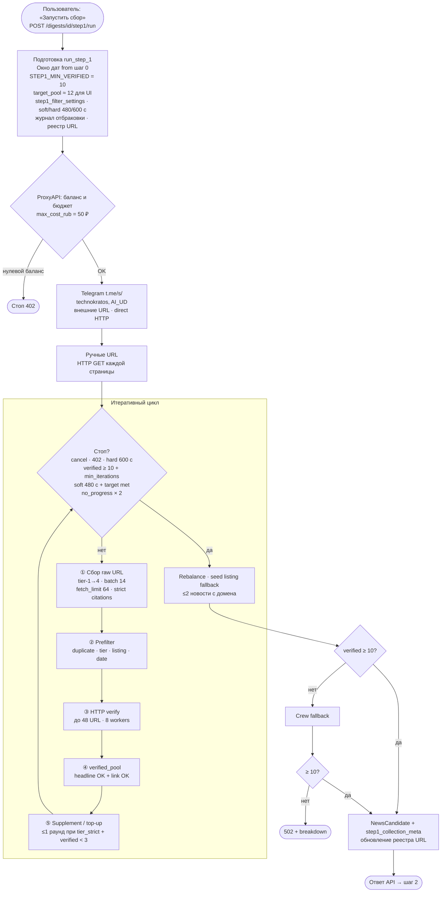
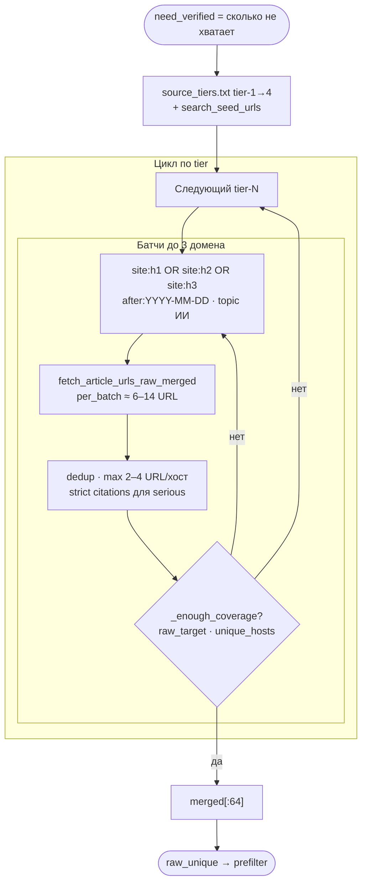
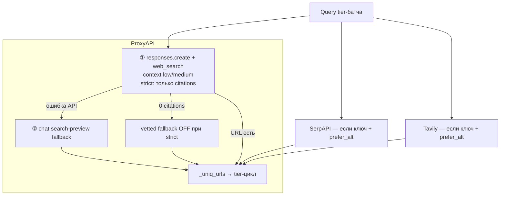
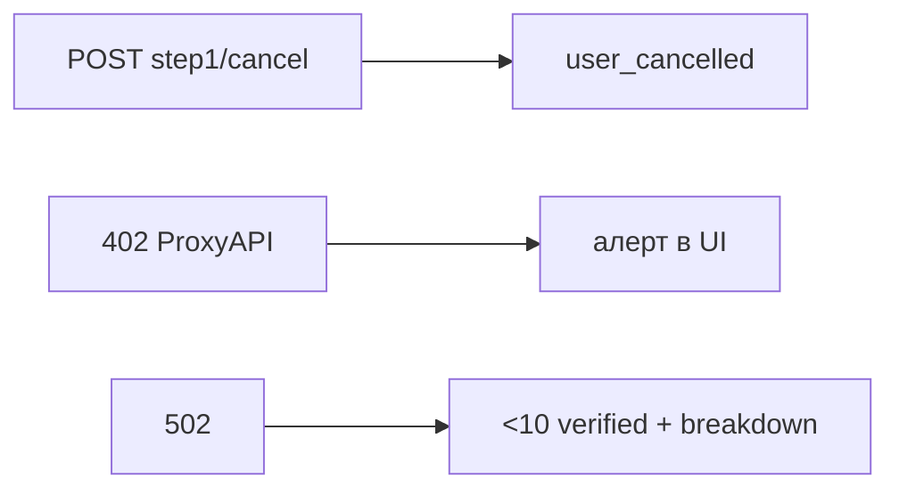

# Шаг 1 — блок-схема поиска и фильтрации ссылок

Описание того, что делает backend при `POST /digests/{id}/step1/run`: от запуска до сохранения пула кандидатов.

Связанные документы: [STEP1_PIPELINE.md](STEP1_PIPELINE.md), [STEP1_LINKS_RUNBOOK.md](STEP1_LINKS_RUNBOOK.md).

---

## Где тратятся время и токены ProxyAPI

| Этап | Долго? | ProxyAPI / другое | Метод / API |
|------|--------|-------------------|-------------|
| Проверка баланса ключа | быстро | ProxyAPI REST | `GET …/proxyapi/balance` |
| Tier-поиск сырых URL | **да, 1–5 мин на проход** | **ProxyAPI** web_search (`low`/`medium`), до **12** батчей/collect | `fetch_tier_prioritized_raw_urls` |
| Prefilter (без HTTP) | быстро | локально | без LLM |
| HTTP-верификация страниц | **да, 1–3 мин на 48 URL** | **не ProxyAPI** | `requests.get`, 8 workers |
| Crew fallback (если <10) | очень долго | ProxyAPI через Crew/LiteLLM | `chat.completions` агентов |
| Перевод заголовка | иногда | ProxyAPI | `ProxyApiClient.chat` |

**Типичный узкий участок:** tier-поиск → HTTP-проверка → мало прошло → supplement/top-up (повтор того же алгоритма с меньшим cap).

---

## Общая блок-схема шага 1



---

## Детально: сбор сырых URL

**Сырые URL (`raw_unique`) — ещё не проверенные новости.** Это ссылки из поиска **до** prefilter и HTTP.

Код: `_collect_search_verified_candidates` → `fetch_tier_prioritized_raw_urls` → `fetch_article_urls_raw_merged` → `ProxyApiClient.search_news_article_urls`.

### Уровень 1 — обход tier-1…4



| Параметр | Значение | Смысл |
|----------|----------|--------|
| `fetch_limit` | 64 | Верхняя граница raw за collect |
| `batch_size` | 14 | URL в tier-батче |
| `tier_max_web_search_batches` | 12 | Лимит ProxyAPI-батчей |
| `max_urls_per_host` | 2–4 | Не класть все ссылки с одного сайта |

### Short-pool режим (verified < 10)

- реестр URL не используется как основной seed;
- context **medium**, фаза tier-поиска 90–150 с;
- `force_proxyapi` — ProxyAPI даже при `empty_citation_streak`;
- foreign `-defer` tiers пропускаются, пока verified < 6.

### Уровень 2 — провайдеры одного батча



По умолчанию `web_search_prefer_alt_providers: false` — только ProxyAPI.

### Реестр и кэш

| Компонент | Назначение |
|-----------|------------|
| `step1_url_registry.py` | raw / verified / reject между прогонами, TTL 90 д |
| `step1_web_search_cache.py` | кэш ответов ProxyAPI web_search |
| `step1_web_search_stats.py` | citations vs model URLs в метриках |

---

## Prefilter → HTTP → фильтры на странице

```mermaid
flowchart TD
    RAWIN(["raw_unique"]) --> PF

    subgraph PFILTER["Prefilter без HTTP"]
        PF["invalid_url · duplicate · recent_top5"]
        PF --> PF2["non_policy_source · forbidden_media"]
        PF2 --> PF3["news_listing_page · support_documentation"]
        PF3 --> PF4["llm_hallucinated · published_before_window"]
    end

    PFILTER --> PRIOR["Очередь HTTP до 48 URL<br/>tier-1 первыми"]
    PRIOR --> INGEST

    subgraph INGEST["Listing expansion"]
        INGEST{"listing URL?"}
        INGEST -->|да| EXP["HTTP GET ленты<br/>до 4 дочерних статей"]
        INGEST -->|нет| POOL
        EXP --> POOL["8 workers · requests.get"]
        POOL --> VER["_verify_llm_candidate_dict"]
    end

    VER --> OK{"verified?"}
    OK -->|да| POOLADD["verified_pool[]"]
    OK -->|нет| REJ["register_reject"]
```

### Типичные причины «мало в пуле»

| Симптом в логе | Что значит |
|----------------|------------|
| `count=40+ unique_hosts=10+` | Сырых ссылок достаточно — проблема в HTTP/фильтрах |
| `published_before_window` доминирует | Stale URL; при short pool реестр отключён |
| `empty citations` + strict | Батч не дал URL — vetted fallback заблокирован |
| `urls_sent_to_http` < 10 | Мало прошло prefilter или tier-поиск обрезан по timebox |
| `stop=hard_timeout` | 600 с исчерпаны до набора 10 verified |

---

## Остановка и ошибки



---

## Ссылки на код

| Узел | Файл / функция |
|------|----------------|
| Итеративный цикл | `digest_service.py` → `_step1_collect_iterative_batches` |
| Tier-обход | `news_search.py` → `fetch_tier_prioritized_raw_urls` |
| Strict citations | `news_search.py` → `set_step1_strict_citations` |
| Реестр URL | `step1_url_registry.py` |
| ProxyAPI web_search | `proxyapi_client.py` → `search_news_article_urls` |
| Prefilter | `news_search.py` → `search_url_prefilter_reason` |
| HTTP + verify | `digest_service.py` → `_verify_llm_candidate_dict` |
| Статистика | `step1_statistics.py`, `GET …/step1/statistics` |
| Отмена | `step1_cancellation.py` |

Документация ProxyAPI: [proxyapi.ru/docs/openai-web-search](https://proxyapi.ru/docs/openai-web-search).
