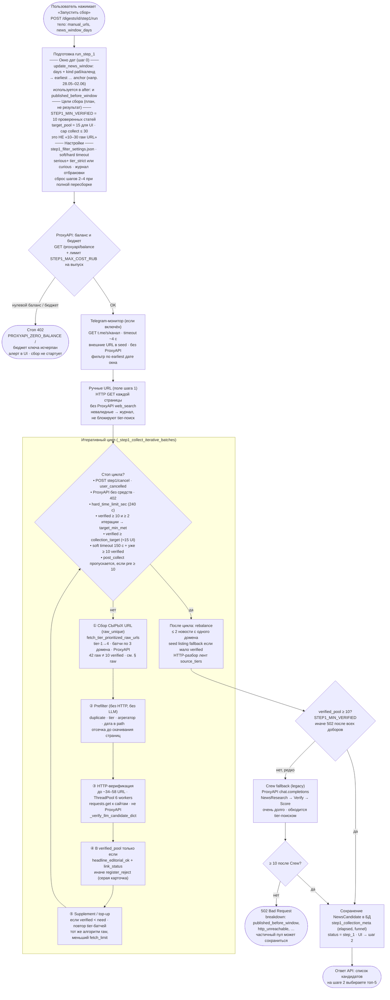
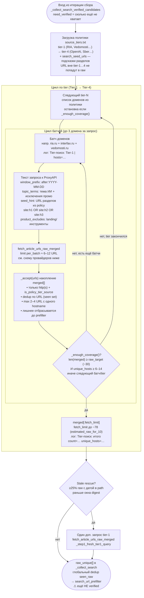
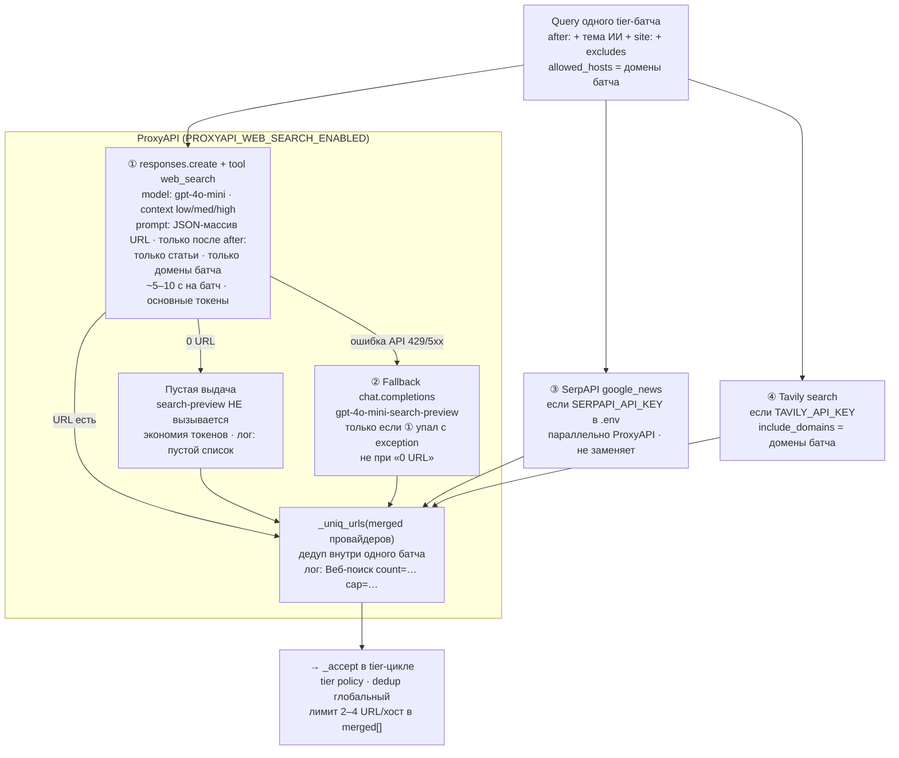
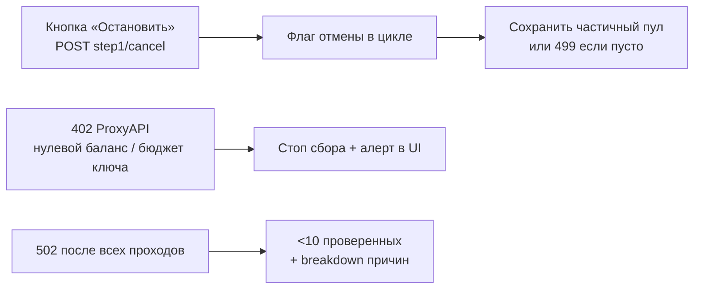

# Шаг 1 — блок-схема поиска и фильтрации ссылок

Понятное описание того, что делает backend при `POST /digests/{id}/step1/run`: от запуска до сохранения пула кандидатов. **Пояснения встроены в узлы блок-схем** (не только в текст ниже).

Связанные документы: [STEP1_PIPELINE.md](STEP1_PIPELINE.md), [STEP1_LINKS_RUNBOOK.md](STEP1_LINKS_RUNBOOK.md).

---

## Где тратятся время и токены ProxyAPI

| Этап | Долго? | ProxyAPI / другое | Метод / API |
|------|--------|-------------------|-------------|
| Проверка баланса ключа | быстро | ProxyAPI REST | `GET …/proxyapi/balance` (`ProxyApiCostTracker.get_balance_snapshot`) |
| Tier-поиск сырых URL | **да, 1–3 мин на проход** | **ProxyAPI** web_search (`low`), лимит **6** батчей/collect; SerpAPI/Tavily опциональны | см. [STEP1_COST_OPTIMIZATION_STEPS.md](STEP1_COST_OPTIMIZATION_STEPS.md) |
| Prefilter (без HTTP) | быстро | локально | без LLM |
| HTTP-верификация страниц | **да, 1–2 мин на 30–40 URL** | **не ProxyAPI** | обычный `requests.get` к сайтам |
| Crew fallback (если &lt;10) | очень долго | ProxyAPI через Crew/LiteLLM | `chat.completions` агентов |
| Перевод заголовка | иногда | ProxyAPI | `ProxyApiClient.chat` |

**Главный тормоз в вашем логе:** не «один медленный raw-запрос», а цепочка **много tier-батчей → HTTP-проверка → мало прошло → повторный добор** (15+ минут на одну итерацию при конверсии 2 из 34).

---

## Общая блок-схема шага 1



---

## Детально: сбор сырых URL

**Важно:** «сырые URL» (`raw_unique`) — это ещё **не** проверенные новости. Это ссылки из поиска **до** prefilter и HTTP. Цель verified (минимум **10** статей в пуле) — отдельный этап ниже по схеме.

Код: `_collect_search_verified_candidates` → `fetch_tier_prioritized_raw_urls` → `fetch_article_urls_raw_merged` → `ProxyApiClient.search_news_article_urls`.

### Уровень 1 — обход tier-1…4 (`fetch_tier_prioritized_raw_urls`)



| Параметр | Типичное значение | Смысл |
|----------|-------------------|--------|
| `fetch_limit` | до 78 (из `estimated_raw_for_10`) | Верхняя граница raw за один проход |
| `raw_target` | 18–30 | Когда остановить обход tier |
| `min_unique_hosts_target` | 6–14 | Минимум разных доменов в raw |
| `max_urls_per_host` | 2–4 | Не класть все ссылки с одного сайта |
| `per_batch_limit` | 6–12 | Лимит URL с одного ProxyAPI-батча |

**digest 20 (факт):** один полный проход tier → **42 raw**, **14 хостов**, **~99 с**; supplement/top-up повторяют тот же алгоритм с меньшим `fetch_limit`.

### Уровень 2 — один батч: провайдеры (`fetch_article_urls_raw_merged`)

На **каждый** tier-батч вызывается один merge — не «кто первый ответил», а **объединение всех провайдеров**.



### Уровень 3 — когда tier-поиск повторяется

| Ситуация | Что происходит |
|----------|----------------|
| Первая итерация collect | Полный `fetch_tier_prioritized_raw_urls` (`fetch_limit` ≈ 78) |
| Supplement / top-up в цикле | Тот же tier-обход, меньший cap (напр. 24 URL) |
| Много `published_before_window` | Опциональный rescue-батч только по tier-1 |
| Seed listing fallback | **Не** ProxyAPI: HTTP-разбор лент из `search_seed_urls` |

### Пояснения простым языком

1. **Сырые URL ≠ verified.** ProxyAPI может вернуть 42 ссылки; после prefilter+HTTP в пул попадут единицы.

2. **Tier-поиск** — десятки маленьких запросов по `source_tiers.txt`, не один «найди новости про ИИ». Каждый батч ≈ 5–10 с ProxyAPI.

3. **ProxyAPI Responses + web_search** — основной метод; модель возвращает JSON-массив URL.

4. **Chat search-preview** — только при **ошибке** API; при пустой выдаче второй раз не платим.

5. **SerpAPI / Tavily** — подмешиваются в каждый батch, если ключи в `.env`.

6. После `raw_unique` идёт **prefilter** (без HTTP), затем **HTTP-верификация** — отдельный этап, не ProxyAPI.

---

## Детально: prefilter → HTTP → фильтры на странице

```mermaid
flowchart TD
    RAWIN(["raw_unique после tier-поиска<br/>ссылки из ProxyAPI · ещё не проверены"]) --> PF

    subgraph PFILTER["Prefilter search_url_prefilter_reason<br/>без HTTP · без LLM · по порядку фильтров"]
        PF["Обход каждого URL"]
        PF --> PF1["invalid_url · duplicate_url_skip<br/>recent_top5_repeat (зафиксированные топ-5)"]
        PF1 --> PF2["non_policy_source — вне tier-1…4<br/>aggregator_source · forbidden_media"]
        PF2 --> PF3["news_listing_page — часть лент<br/>не отсекаем: пойдут на разворот"]
        PF3 --> PF4["llm_hallucinated_url · product_tool_page<br/>дата в path → published_before_window"]
    end

    PFILTER --> PRIOR["Приоритизация очереди HTTP<br/>tier-1 и свежие URL первыми<br/>лимит urls_sent_to_http ~34–58"]
    PRIOR --> INGEST

    subgraph INGEST["_ingest_step1_urls_with_listing_expansion"]
        INGEST{"listing / topic URL?<br/>vc.ru/ai · habr.com/hubs/…"}
        INGEST -->|да| EXP["HTTP GET ленты<br/>извлечь до 4 дочерних статей<br/>_expand_listing_url_candidates"]
        INGEST -->|нет| POOL
        EXP --> POOL["pending queue<br/>max ~34–58 URL за проход<br/>max 4 URL с одного host"]
        POOL --> WORK["ThreadPoolExecutor 6 workers<br/>requests.get HTML каждого URL<br/>таймаут ~4–8 с · не ProxyAPI"]
        WORK --> VER["_verify_llm_candidate_dict<br/>редирект OK? · заголовок editorial<br/>тема ИИ · дата в окне · не промо/лента"]
    end

    VER --> OK{"page_verified?<br/>headline OK ∧ link OK"}
    OK -->|да| POOLADD["verified_pool[]<br/>считается для STEP1_MIN_VERIFIED=10"]
    OK -->|нет| REJ["register_reject + код<br/>серая карточка в UI<br/>напр. published_before_window"]
```

### Типичные причины «мало в пуле» после долгого прогона

| Симптом в логе | Что значит |
|----------------|------------|
| `Tier-поиск: итого … count=42 unique_hosts=14` | Сырых ссылок достаточно, проблема не в поиске |
| `prefilter=8 http=34 need_verified=10` | 8 отсеяли до HTTP, 34 пошли на проверку |
| `verified=2 elapsed_sec=57` | **Узкое место:** HTTP + фильтры на странице |
| `published_before_window` в статистике | Выдача ProxyAPI отдаёт **старые** URL |
| `ProxyAPI web_search: пустой список` | Батч tier не дал ссылок — токены частично потрачены, URL нет |
| Повтор tier-поиска через 3–5 мин | **top-up / supplement** — добор до минимума 10 |

---

## Остановка и ошибки



---

## Ссылки на код

| Узел схемы | Файл / функция |
|------------|----------------|
| Итеративный цикл | `digest_service.py` → `_step1_collect_iterative_batches` |
| Tier-обход raw | `news_search.py` → `fetch_tier_prioritized_raw_urls` |
| Merge провайдеров батча | `news_search.py` → `fetch_article_urls_raw_merged` |
| Stale rescue tier-1 | `digest_service.py` → `_collect_search_verified_candidates` |
| ProxyAPI web_search | `proxyapi_client.py` → `search_news_article_urls` |
| Prefilter | `news_search.py` → `search_url_prefilter_reason` |
| HTTP + verify | `digest_service.py` → `_ingest_step1_urls_with_listing_expansion`, `_verify_llm_candidate_dict` |
| Разворот лент | `digest_service.py` → `_expand_listing_url_candidates` |
| Отмена | `step1_cancellation.py`, `POST …/step1/cancel` |

Документация ProxyAPI web_search: [proxyapi.ru/docs/openai-web-search](https://proxyapi.ru/docs/openai-web-search).
